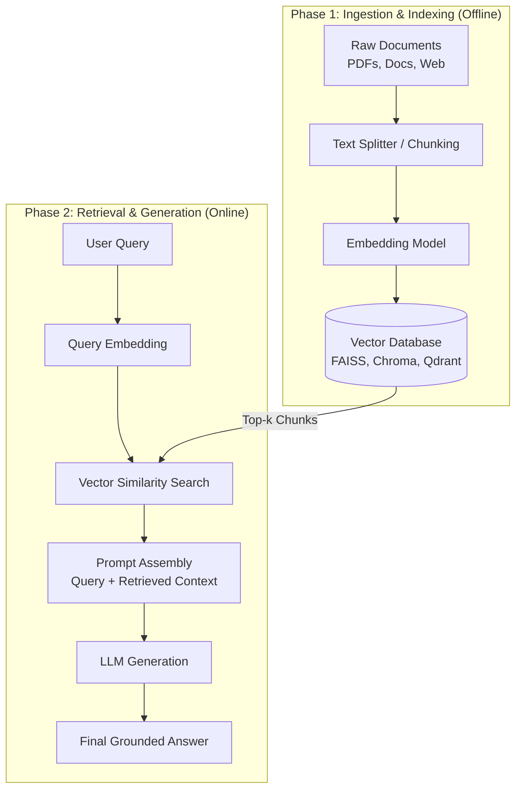
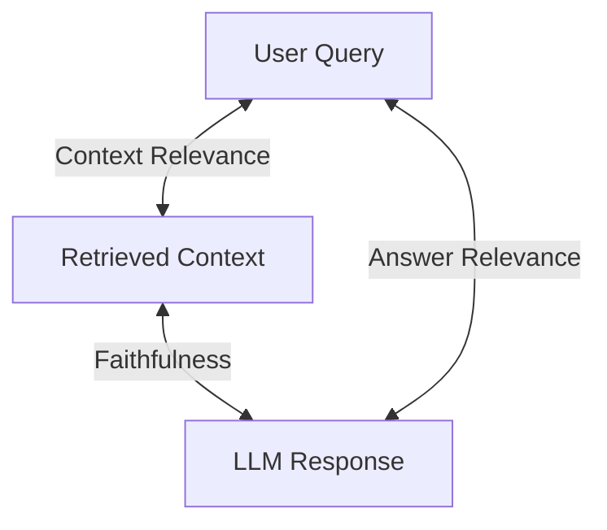

# 🧠 Comprehensive Notes: Retrieval-Augmented Generation (RAG)

## 📌 1. What is RAG?
**Retrieval-Augmented Generation (RAG)** is an architectural pattern in Generative AI that combines **Information Retrieval (IR)** systems with **Large Language Models (LLMs)**.

Instead of relying solely on the parametric knowledge baked into an LLM during pre-training, RAG fetches relevant context from an external data source (vector databases, documents, SQL databases, web pages) and feeds that context into the LLM alongside the user prompt to generate accurate, context-aware answers.

---

## ⚡ 2. Why RAG? (Core Problems Solved)

| LLM Limitation | How RAG Fixes It |
| :--- | :--- |
| **Hallucinations** | Grounds the model's responses in factual, external source documents. |
| **Knowledge Cutoff** | Connects LLMs dynamically to real-time or updated internal data without retraining. |
| **Private Data Access** | Enables querying domain-specific knowledge (corporate wikis, PDFs, codebases). |
| **Cost & Efficiency** | Avoids expensive LLM fine-tuning or full pre-training runs. |
| **Verifiability / Citation** | Enables pointing to exact source documents/chunks used for the output. |

---

## 🏗️ 3. RAG Architecture & System Workflow

A standard RAG pipeline operates in two main phases: **Ingestion Phase (Offline)** and **Retrieval & Generation Phase (Online)**.

### Mermaid Flowchart



---

## ⚙️ 4. Key Components Explained

### 4.1 Document Loading & Chunking Strategies
Raw text must be divided into smaller pieces (**chunks**) so they fit into vector embedding models and LLM context windows.

- **Fixed-Size Chunking**: Splits text into fixed character or token counts (e.g., 500 characters with 50-character overlap).
- **Recursive Character Chunking**: Recursively splits by separator hierarchy (`\n\n`, `\n`, space, `""`) to keep paragraphs and sentences intact.
- **Semantic Chunking**: Analyzes sentence embeddings and splits text when semantic distance between consecutive sentences exceeds a threshold.
- **Document Structure Chunking**: Splits based on HTML headers, Markdown `#` titles, or code ASTs.

---

### 4.2 Vector Embeddings & Similarity Metrics
Embedding models map text chunks into continuous high-dimensional vector spaces \(\mathbb{R}^d\). Semantically similar texts are placed close to each other.

#### Similarity Formulas:

1. **Cosine Similarity**: Measures the cosine of the angle between two vectors (range: \([-1, 1]\)):
   \[
   \text{Cosine Similarity}(u, v) = \frac{u \cdot v}{\|u\|_2 \|v\|_2} = \frac{\sum_{i=1}^d u_i v_i}{\sqrt{\sum_{i=1}^d u_i^2} \sqrt{\sum_{i=1}^d v_i^2}}
   \]

2. **Dot Product**: Inner product of vectors (equivalent to cosine similarity if vectors are normalized):
   \[
   \text{Dot Product}(u, v) = u \cdot v = \sum_{i=1}^d u_i v_i
   \]

3. **Euclidean Distance (\(L_2\))**: Straight-line distance between points in vector space:
   \[
   d_{\text{Euclidean}}(u, v) = \sqrt{\sum_{i=1}^d (u_i - v_i)^2}
   \]

---

### 4.3 Vector Databases (Vector Stores)
Vector DBs store chunk vectors and perform fast **Approximate Nearest Neighbor (ANN)** searches using algorithms like **HNSW** (Hierarchical Navigable Small World) or **IVF** (Inverted File Index).

- **Popular Vector DBs**:
  - Local/Embedded: **FAISS**, **ChromaDB**, **LanceDB**
  - Cloud/Distributed: **Qdrant**, **Pinecone**, **Milvus**, **Weaviate**

---

### 4.4 Advanced RAG Techniques

1. **Hybrid Search (Dense + Sparse)**:
   - Combines **Dense Vector Search** (semantic similarity) with **Sparse Search** (BM25 keyword matching).
   - Merged using **Reciprocal Rank Fusion (RRF)**.

2. **Reranking**:
   - Uses a **Cross-Encoder Model** (e.g., Cohere Rerank, `bge-reranker-large`) to re-score the top-\(N\) retrieved chunks for higher relevance precision.

3. **Query Transformation**:
   - **HyDE (Hypothetical Document Embeddings)**: LLM generates a fake hypothetical answer; that answer is embedded to search for real context.
   - **Multi-Query Expansion**: LLM breaks user query into multiple sub-queries to retrieve diverse context.
   - **Step-Back Prompting**: LLM abstracts user query into broader high-level concepts.

---

## 📊 5. RAG Evaluation Metrics (The RAG Triad)



1. **Context Relevance**: Are the retrieved text chunks relevant to the user query?
2. **Faithfulness (Groundedness)**: Is the LLM response derived strictly from the retrieved context without hallucinating?
3. **Answer Relevance**: Does the response directly address the original query?

*Evaluation Libraries*: **Ragas**, **TruLens**, **DeepEval**.

---

## 💻 6. Implementation Example (Python & LangChain)

```python
import os
from langchain_community.document_loaders import TextLoader
from langchain_text_splitters import RecursiveCharacterTextSplitter
from langchain_community.vectorstores import FAISS
from langchain_huggingface import HuggingFaceEmbeddings
from langchain_google_genai import ChatGoogleGenerativeAI
from langchain_core.prompts import ChatPromptTemplate
from langchain_core.runnables import RunnablePassthrough
from langchain_core.output_parsers import StrOutputParser

# 1. Load Document
loader = TextLoader("RAG/text.tx")
documents = loader.load()

# 2. Chunking
text_splitter = RecursiveCharacterTextSplitter(chunk_size=500, chunk_overlap=50)
chunks = text_splitter.split_documents(documents)

# 3. Vector Embeddings & Vector Store
embeddings = HuggingFaceEmbeddings(model_name="sentence-transformers/all-MiniLM-L6-v2")
vectorstore = FAISS.from_documents(chunks, embeddings)
retriever = vectorstore.as_retriever(search_kwargs={"k": 3})

# 4. LLM & RAG Chain Setup
llm = ChatGoogleGenerativeAI(model="gemini-1.5-flash", temperature=0)

prompt = ChatPromptTemplate.from_template("""
Answer the question based ONLY on the following context:

{context}

Question: {question}
""")

def format_docs(docs):
    return "\n\n".join(doc.page_content for doc in docs)

rag_chain = (
    {"context": retriever | format_docs, "question": RunnablePassthrough()}
    | prompt
    | llm
    | StrOutputParser()
)

# 5. Execution
response = rag_chain.invoke("What is RAG?")
print("Response:", response)
```

---

## 📝 7. Summary Quick-Reference
- **RAG = Retrieve + Augment + Generate**.
- **Key Modules**: Loader \(\rightarrow\) Splitter \(\rightarrow\) Embedder \(\rightarrow\) Vector DB \(\rightarrow\) Retriever \(\rightarrow\) Prompt \(\rightarrow\) LLM.
- **Optimization**: Hybrid Search + Reranking + Semantic Chunking + Ragas Evaluation.
